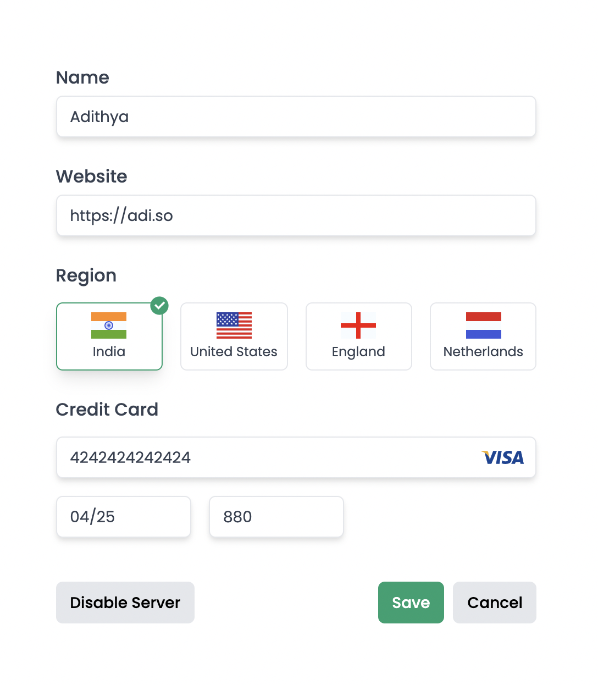

<!-- PROJECT LOGO -->
<br />
<p align="center">
  <h3 align="center">Angular Custom Form Controls</h3>

  <p align="center">
   Create totally custom form elements in Angular using Control Value Accessor
    <br />
    <br />
  </p>

  <p align="center">
   
   
   
  </p>
</p>

## Control Value Accessor

How to create custom form controls in Angular using ControlValueAccessor? We can create custom form components and connect them to either template-driven forms or reactive forms.



Ref: https://angular.io/api/forms/ControlValueAccessor

## Running Locally

1. Clone the repository

```
git clone https://github.com/adisreyaj/custom-form-controls.git
```

2. Install Dependencies

```sh
npm install
```

3. Start the dev server

```sh
npm start
```

4. Browse the URL

```
http://localhost:4200
```

## Show your support

Please ⭐️ this repository if this project helped you!
